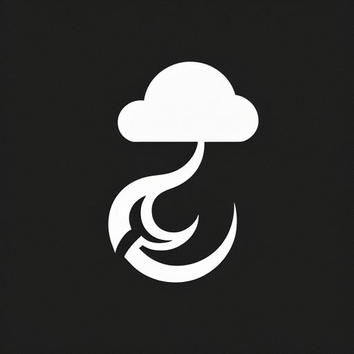

# Welcome to Cloud Scythe Labs

Cloud Scythe Labs is an organization of innovators, hell bent on producing clean, cutting edge and exciting software.

## Core Team
- [andrewvious](github.com/andrewvious) -- our database management & cloud compute expert
- [eureka-cpu](github.com/eureka-cpu) -- our software architect & devops engineer

### Our Tools
- Rust -- The primary language for our software, known for its small binaries, speed and safety
- Nix -- For its reliability, developer environments and robust ecosystem

## In Progress Projects
> All of our projects are currently closed source. Please consider giving us a follow to track releases as they occur.
- _`cloud-reaper`_ -- A cloud collaboration plug-in for the REAPER digital audio workstation
- More TBA

## Contributing
**A special thanks to our external contributors:**
Whether your input made it into the commits or not, we appreciate all of the support you've given us.

- [iynaix](github.com/iynaix) -- Nix contributor/consult
- [sezna](github.com/sezna) -- Rust contributor/consult
- [tfc](github.com/tfc) -- Nix contributor/consult (co-founder of [Nixcademy](https://nixcademy.com/), which we highly recommend)

Currently, our projects are by invitation only. If you're interested in becoming an external contributor, please send us an email directly at github.eureka@gmail.com
